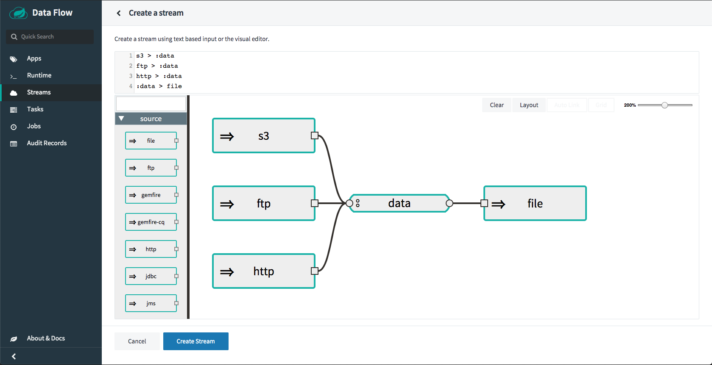

# Fan-in and Fan-out

By using named destinations, you can support fan-in and fan-out use cases.
Fan-in use cases are when multiple sources all send data to the same named destination, as shown in the following example:

```
s3 > :data
ftp > :data
http > :data
```

The preceding example directs the data payloads from the Amazon S3, FTP, and HTTP sources to the same named destination called `data`.
Then an additional stream created with the following DSL expression would have all the data from those three sources sent to the file sink:

`:data > file`

A graphical representation can be seen as follows:



The fan-out use case is when you determine the destination of a stream based on some information that is only known at runtime.
In this case, the [Router Application](https://docs.spring.io/spring-cloud-stream-app-starters/docs/%streaming-apps-latest%/reference/html/spring-cloud-stream-modules-sinks.html#spring-cloud-stream-modules-router-sink) can be used to specify how to direct the incoming message to one of N named destinations.

A nice [Video](https://youtu.be/l8SgHtP5QCI) showing Fan-in and Fan-out behavior is also available.
